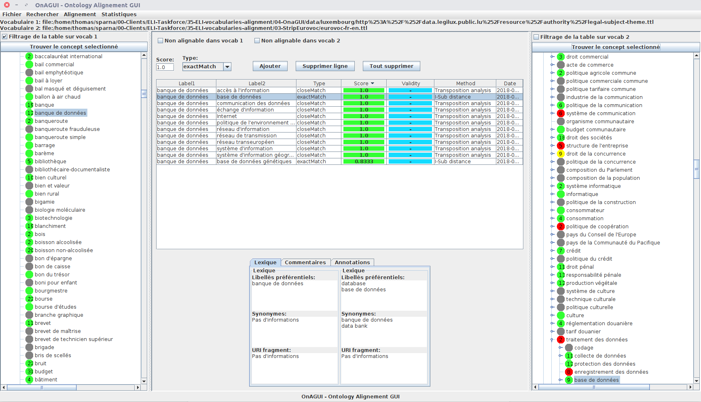

# OnAGUI 

OnAGUI - Ontology Alignment GUI - Software to help automatic or manual realisation of ontologic alignment

OnAGUI can align [SKOS](https://www.w3.org/2004/02/skos/) thesauri, [OWL](https://www.w3.org/TR/owl2-overview/) ontologies, or arbitrary [RDF](https://www.w3.org/2001/sw/wiki/RDF) entities (based on common labelling properties).

You can download OnAGUI from the [releases](https://github.com/lmazuel/onagui/releases) section ,ad you can read more in the [wiki section](https://github.com/lmazuel/onagui/wiki) !

OnAGUI is a Java application that can be run on Windows or Linux; it only requires Java8 to be installed.

